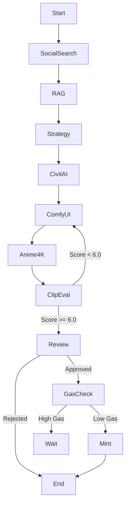

# SOTA Content Farm Workflow

This document outlines the advanced LangGraph workflow for the Digital Content Farm.

## Workflow Steps

1.  **Social Intelligence (Parallel)**
    *   **Reddit**: Fetch hot posts from r/NFT, r/DigitalArt.
    *   **YouTube**: Fetch trending videos in "NFT" or "Generative Art".
    *   **NFT Market**: Fetch top collections from OpenSea.
    *   *Output*: Aggregated Trend Report.

2.  **Context Retrieval (RAG)**
    *   Query `ChromaDB` for historical performance of similar trends.
    *   *Output*: Contextualized Trend Analysis.

3.  **Strategy Formulation**
    *   **Gemini**: Analyze Trends + Context.
    *   *Output*: `ArtPrompt`, `NegativePrompt`, `StyleKeywords`, `ListingPrice`, `Duration`.

4.  **Asset Acquisition**
    *   **CivitAI**: Search for LoRAs matching `StyleKeywords`.
    *   *Action*: Download LoRA if not present.
    *   *Output*: Path to best matching LoRA.

5.  **Content Generation**
    *   **ComfyUI**: Load SOTA Workflow (SDXL/Flux).
    *   *Inject*: Prompt, LoRA, Dimensions.
    *   *Output*: Raw Image(s).

6.  **Post-Processing**
    *   **Anime4K**: Upscale image (if applicable).
    *   *Output*: High-Res Image.

7.  **Automated Evaluation**
    *   **CLIP**: Calculate Aesthetic Score & Prompt Alignment Score.
    *   *Logic*: If score < Threshold, Reject/Retry (Loop back to Gen).
    *   *Output*: `Score`.

8.  **Human Review**
    *   **Gradio**: Show Image, Strategy, Trends, and CLIP Score.
    *   *Action*: Approve or Reject.

9.  **Monetization**
    *   **Gas Check**: Ensure Gwei < Limit.
    *   **Mint**: Upload to IPFS -> Mint on Chain.
    *   *Output*: OpenSea Link.

## Graph Structure

