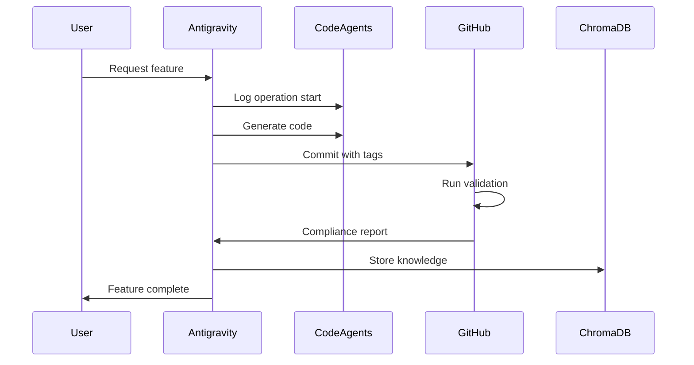
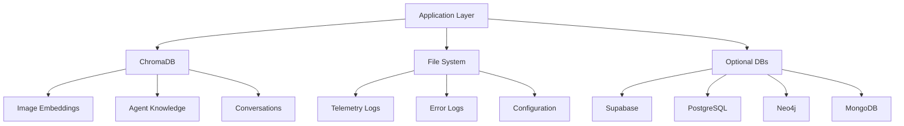

# EudoraX Prototype Architecture

## System Overview

EudoraX Prototype is a **multi-agent AI development platform** designed to facilitate collaborative work between different AI systems while providing specialized tools for image processing, model management, and workflow automation.

### Core Design Principles

1. **Multi-Agent Collaboration**: Multiple AI agents work together with defined protocols
2. **Modular Architecture**: Tools are independent but share common infrastructure
3. **Telemetry-Driven**: All agent operations are logged for analysis and improvement
4. **Developer-Friendly**: Clear separation of concerns with comprehensive documentation

---

## High-Level Architecture

```
┌─────────────────────────────────────────────────────────────────┐
│                         EudoraX Prototype                        │
├─────────────────────────────────────────────────────────────────┤
│                                                                  │
│  ┌────────────────┐  ┌────────────────┐  ┌──────────────────┐  │
│  │  CodeAgents    │  │   Tools Layer   │  │  Backend API     │  │
│  │   Framework    │  │  (Pylorix, etc) │  │   (FastAPI)      │  │
│  └────────────────┘  └────────────────┘  └──────────────────┘  │
│           │                   │                     │            │
│           └───────────────────┴─────────────────────┘            │
│                               │                                  │
│                    ┌──────────▼──────────┐                       │
│                    │   Storage Layer     │                       │
│                    │  (ChromaDB, Files)  │                       │
│                    └─────────────────────┘                       │
└─────────────────────────────────────────────────────────────────┘
```

---

## Component Architecture

### 1. CodeAgents Framework

The multi-agent collaboration system that coordinates different AI assistants.

#### Structure
```
CodeAgents/
├── {AgentName}/           # One directory per agent
│   ├── logs/             # Operation telemetry (JSON)
│   ├── errors/           # Error logs with stack traces
│   └── metadata.json     # Agent configuration
│
├── Training/             # Shared training resources
│   ├── chroma_db/       # Vector embeddings database
│   ├── datasets/        # Training datasets
│   └── models/          # Shared model weights
│
├── Memory/              # Shared context and memory
│   ├── conversations/   # Conversation histories
│   ├── decisions/       # Decision logs
│   └── knowledge/       # Extracted knowledge base
│
├── core/                # Core agent modules
│   ├── telemetry.py    # Logging infrastructure
│   ├── coordination.py # Agent coordination logic
│   └── protocol.py     # Protocol implementation
│
└── access_control.json  # Permissions and rules
```

#### Agent Protocol (from Agents.MD)

Each agent follows a standardized protocol:

**Operation Format:**
```json
{
  "agent": "AgentName",
  "timestamp": "2025-12-03T05:13:37Z",
  "operation": "CREATE|REFACTOR|DEBUG|MODIFY",
  "target": {
    "file": "path/to/file.py",
    "function": "function_name",
    "lines": [10, 50]
  },
  "status": "SUCCESS|FAILURE|PENDING"
}
```

**Code Annotation:**
```python
# [CREATE] New feature implementation
# Agent: AgentName
# Timestamp: 2025-12-03T05:13:37Z

def new_feature():
    """Comprehensive docstring following Google style."""
    pass
```

#### Supported Agents

| Agent | Provider | Specialization |
|-------|----------|----------------|
| Antigravity | Google DeepMind | Code generation, refactoring |
| ClaudeCode | Anthropic | Complex reasoning, documentation |
| GeminiFlash25 | Google | Fast iterations, prototyping |
| GeminiPro25 | Google | Deep analysis, architecture |
| GrokIA | xAI | Research, exploration |
| Jules | Custom | Workflow automation |

---

### 2. Tools Layer

Specialized tools for specific tasks, designed to be modular and independent.

#### Pylorix - Image Processing Suite

**Architecture:**
```
Pylorix/
├── app.py                  # Main Gradio interface
├── api_server.py          # FastAPI REST endpoints
│
├── modules/               # Feature modules
│   ├── flux_generator.py  # FLUX.2 text-to-image
│   ├── evaluation.py      # Image quality metrics
│   ├── upscale.py         # Upscaling algorithms
│   ├── light_correction.py # Exposure correction
│   ├── retinex.py         # Retinex enhancement
│   ├── luts3d.py          # 3D LUT color grading
│   ├── lora_trainer.py    # LoRA fine-tuning
│   ├── vector_db.py       # Vector database
│   ├── database_tester.py # Multi-DB benchmarking
│   └── civitai_client.py  # Civitai integration
│
├── FLUX.2-dev/            # FLUX model directory (auto-downloaded)
└── models/                # Downloaded models
```

**Module Interaction Flow:**
```
User Input (Gradio UI)
    │
    ▼
Main App (app.py)
    │
    ├──▶ FLUX Generator ──▶ Image Generation
    ├──▶ Evaluator ──▶ Quality Metrics
    ├──▶ Upscaler ──▶ Resolution Enhancement
    ├──▶ Vector DB ──▶ ChromaDB Storage
    └──▶ Database Tester ──▶ Performance Benchmarking
```

**Key Features:**

1. **FLUX.2 Integration**
   - Model: Black Forest Labs FLUX.2-dev
   - Local inference with fallback to API
   - Customizable parameters (steps, guidance, dimensions)

2. **Image Evaluation**
   - CLIP Score: Semantic similarity
   - ViT Features: Vision transformer analysis
   - Quality Metrics: PSNR, SSIM, LPIPS

3. **Database Testing**
   - Automated benchmarking
   - Grading system (A+ to F)
   - Support for 5 databases:
     - Supabase (cloud)
     - PostgreSQL (relational)
     - ChromaDB (vector)
     - Neo4j (graph)
     - MongoDB (document)

#### Civitai Integration

**Architecture:**
```python
CivitaiClient              # REST API client
    │
    ├── search_models()    # Search model repository
    ├── get_model_versions() # Fetch version info
    └── download_model()   # Download model files

CivitaiLinkHandler        # Socket.IO real-time connection
    │
    ├── connect()         # WebSocket connection
    ├── join()            # Join room with key
    └── on_command()      # Handle real-time commands
```

**Use Cases:**
- Model discovery and browsing
- Automated downloads
- Real-time synchronization with Civitai desktop app
- Version management

---

### 3. Backend API

FastAPI-based REST API for backend services.

**Structure:**
```
backend/
├── main.py              # FastAPI application
├── core/               # Core modules
│   └── access_control.py # Authentication & permissions
└── requirements.txt    # Backend dependencies
```

**API Endpoints** (planned):
```
GET  /api/status         # Service health check
POST /api/generate       # Image generation
GET  /api/models         # List available models
POST /api/evaluate       # Image quality evaluation
GET  /api/agents         # List active agents
```

---

### 4. Storage Layer

Multi-database strategy for different data types.

#### ChromaDB (Primary - Vector Storage)

**Use Case**: Embeddings for images, text, and agent learning

```python
# Default configuration
client = chromadb.PersistentClient(path="CodeAgents/Training/chroma_db")
collection = client.get_or_create_collection("images")

# Storage
collection.add(
    embeddings=[clip_embedding],
    documents=["description"],
    metadatas=[{"source": "pylorix"}],
    ids=["img_001"]
)

# Retrieval
results = collection.query(
    query_embeddings=[query_embedding],
    n_results=10
)
```

**Schema:**
- Collection: `images` - Image embeddings and metadata
- Collection: `agent_knowledge` - Agent learning data
- Collection: `conversations` - Chat embeddings

#### File System (Metadata & Logs)

**Use Case**: Agent telemetry, error logs, configuration

```
CodeAgents/
├── {AgentName}/logs/    # JSON-formatted operation logs
└── {AgentName}/errors/  # Detailed error traces
```

#### Alternative Databases (Optional)

| Database | Use Case | Configuration |
|----------|----------|---------------|
| **Supabase** | Cloud-hosted relational data | REST API + Connection string |
| **PostgreSQL** | Local relational data | SQL schema in `tools/Civitai/containers/db/` |
| **Neo4j** | Graph relationships | Cypher queries for model lineage |
| **MongoDB** | Document storage | JSON documents for flexible schemas |

---

## Data Flow

### Image Generation Workflow

```
1. User Input (Gradio)
   ├─ Prompt: "Cyberpunk city at night"
   ├─ Parameters: 1024x1024, 30 steps, guidance 4.0
   └─ Trigger: Generate button

2. FLUX Generator Module
   ├─ Load model (if not cached)
   ├─ Set random seed (if randomize enabled)
   ├─ Run diffusion inference
   └─ Return generated image

3. Optional Post-Processing
   ├─ Evaluation ──▶ CLIP score, quality metrics
   ├─ Upscaling ──▶ Real-ESRGAN 2x-4x
   ├─ Retinex ──▶ Lighting enhancement
   └─ LUT ──▶ Color grading

4. Storage
   ├─ Save PNG file
   ├─ Extract CLIP embedding
   ├─ Store in Vector DB (ChromaDB)
   └─ Update metadata
```

### Multi-Agent Collaboration Workflow

```
1. User Request
   └─ "Implement new feature X"

2. Agent Coordination
   ├─ Primary Agent: Analyzes request
   ├─ Telemetry: Logs operation start
   └─ Access Control: Validates permissions

3. Code Generation
   ├─ Agent writes code with operation tag
   ├─ Adds docstrings (Google style)
   ├─ Logs telemetry entry
   └─ Commits with agent signature

4. Validation (GitHub Actions)
   ├─ Check docstring coverage (90% target)
   ├─ Validate operation tags
   ├─ Run code quality checks (Ruff, Black)
   ├─ Verify telemetry schema
   └─ Generate compliance report

5. Integration
   ├─ Merge to development branch
   ├─ Update agent statistics
   └─ Store in knowledge base
```

---

## GitHub Actions Workflow

Automated validation pipeline for multi-agent development.

### Workflow Architecture

```
Pull Request/Push
    │
    ├──▶ detect-agent (Job 1)
    │     └─ Extract agent name from branch/commit
    │
    ├──▶ validate-documentation (Job 2)
    │     ├─ Check docstring coverage (interrogate)
    │     ├─ Validate docstring format (pydocstyle)
    │     ├─ Verify operation tags [CREATE]/[REFACTOR]/etc
    │     └─ Check agent signatures
    │
    ├──▶ validate-code-quality (Job 3)
    │     ├─ Ruff (linting)
    │     ├─ Black (formatting)
    │     ├─ isort (import sorting)
    │     └─ MyPy (type checking)
    │
    ├──▶ validate-telemetry (Job 4)
    │     └─ Validate JSON schema for logs/errors
    │
    └──▶ compliance-report (Job 5)
          └─ Generate summary with pass/fail status
```

**Workflow Files:**
- `agent-validation.yml`: Main CI pipeline
- `branch-sync.yml`: Auto-sync between branches
- `merge-orchestrator.yml`: Automated merge management
- `telemetry-collector.yml`: Aggregate agent metrics

---

## Technology Stack

### Core Technologies

| Category | Technologies |
|----------|--------------|
| **Languages** | Python 3.12, JavaScript, TypeScript |
| **AI/ML** | FLUX.2, CLIP, ViT, Real-ESRGAN, SwinIR, LoRA |
| **Web Frameworks** | FastAPI, Gradio, Next.js (libs) |
| **Databases** | ChromaDB, Supabase, PostgreSQL, Neo4j, MongoDB |
| **Package Managers** | UV, npm, pnpm |
| **Code Quality** | Ruff, Black, isort, MyPy, pydocstyle |
| **CI/CD** | GitHub Actions, CircleCI |
| **Testing** | pytest, Playwright |

### Key Dependencies

**Python (Pylorix):**
```
gradio==4.44.1           # Web UI
diffusers==0.31.0        # FLUX.2 model
transformers==4.46.2     # CLIP, ViT
torch==2.5.0             # Deep learning
chromadb==0.5.18         # Vector database
opencv-python==4.10.0    # Image processing
pillow==11.0.0           # Image manipulation
requests==2.32.3         # HTTP client
python-socketio==5.11.4  # Civitai Link
```

**Python (Backend):**
```
fastapi==0.115.4         # REST API
uvicorn==0.32.0          # ASGI server
pydantic==2.9.2          # Data validation
```

### Model Requirements

| Model | Size | RAM | VRAM | Use Case |
|-------|------|-----|------|----------|
| FLUX.2-dev | ~32GB | 16GB+ | 16GB+ | Text-to-image generation |
| CLIP ViT-L/14 | ~800MB | 4GB | 2GB | Image-text embeddings |
| Real-ESRGAN | ~64MB | 4GB | 6GB | Image upscaling |
| ViT-Base | ~330MB | 4GB | 2GB | Feature extraction |

---

## Security & Access Control

### Agent Permissions

Defined in `CodeAgents/access_control.json`:

```json
{
  "agents": {
    "Antigravity": {
      "permissions": ["READ", "WRITE", "EXECUTE"],
      "restricted_paths": ["/secrets/", "/credentials/"],
      "allowed_operations": ["CREATE", "REFACTOR", "DEBUG", "MODIFY"]
    }
  },
  "global_rules": {
    "require_telemetry": true,
    "enforce_docstrings": true,
    "min_docstring_coverage": 0.70
  }
}
```

### Environment Variables

Sensitive data stored in `.env` (gitignored):
- API keys (Civitai, Supabase)
- Database credentials
- Model paths

---

## Performance Considerations

### Optimization Strategies

1. **Model Caching**: FLUX.2 and CLIP models cached in memory after first load
2. **Lazy Loading**: Modules loaded on-demand, not at startup
3. **Batch Processing**: Vector DB operations batched for efficiency
4. **Async Operations**: FastAPI async endpoints for concurrent requests

### Benchmarks

**FLUX.2 Generation** (RTX 4090):
- 1024x1024, 30 steps: ~8-12 seconds
- 512x512, 20 steps: ~3-5 seconds

**ChromaDB Query** (10k vectors):
- Single query: ~10-50ms
- Batch 10 queries: ~80-150ms

**Database Testing** (Pylorix benchmark tool):
- ChromaDB: A+ (95/100)
- Supabase: A (85/100)
- PostgreSQL: A (82/100)

---

## Future Architecture Plans

### Short-term (Q1 2025)
- [ ] Complete Real-ESRGAN and SwinIR integration
- [ ] Implement CLIP embeddings in vector DB
- [ ] Add FastAPI endpoints for all Pylorix features
- [ ] Create Docker containers for each tool

### Medium-term (Q2-Q3 2025)
- [ ] Microservices architecture for tools
- [ ] Kubernetes deployment manifests
- [ ] Distributed ChromaDB cluster
- [ ] Advanced agent coordination (multi-agent consensus)

### Long-term (Q4 2025+)
- [ ] Cloud deployment options (AWS, GCP, Azure)
- [ ] Real-time collaboration UI
- [ ] Plugin system for custom tools
- [ ] Enterprise authentication (OAuth, SAML)

---

## Diagrams

### Agent Collaboration Sequence



### Database Strategy



---

**Last Updated**: 2025-12-03
**Version**: 1.0
**Maintained by**: EudoraX Multi-Agent Team
