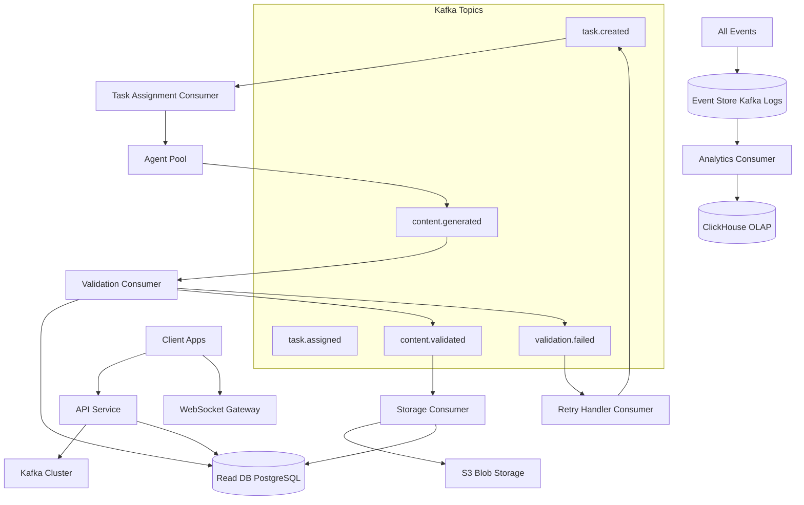
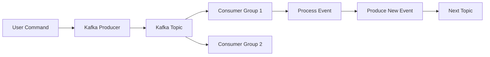
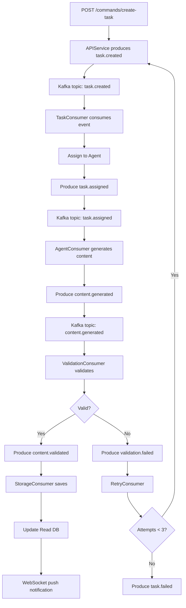
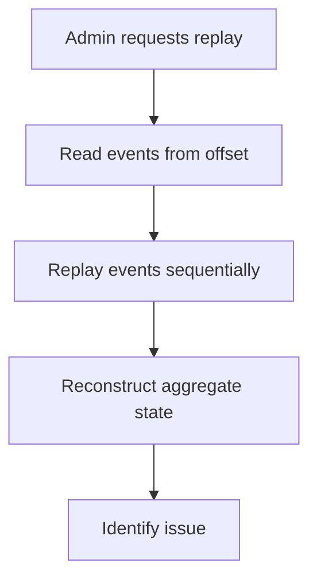

# Design Document - Fazenda de Geração de Conteúdos

## Versão: Arquitetura Event-Driven com Kafka

## Overview

Este design propõe uma arquitetura event-driven usando Apache Kafka como espinha dorsal, com event sourcing e CQRS para escalabilidade máxima e auditoria completa.

## Architecture Design

### System Architecture Diagram



### Data Flow Diagram



## Component Design

### API Service (Command Side - CQRS)

- **Responsabilidades**: Receber comandos, produzir eventos
- **Interfaces**:
  - `POST /commands/create-task` → Produz evento `task.created`
  - `POST /commands/cancel-task` → Produz evento `task.cancelled`
- **Dependências**: Kafka Producer
- **Tecnologia**: Node.js + KafkaJS

### Task Assignment Consumer

- **Responsabilidades**: Consumir `task.created`, escolher agente, produzir `task.assigned`
- **Interfaces**: Kafka Consumer Group `task-assignment-group`
- **Dependências**: Kafka, Agent Registry
- **Tecnologia**: Python + kafka-python
- **Configuração**:
  - Consumer group: `task-assignment`
  - Auto-commit: false
  - Partitions: 12

### Agent Pool (Stateless Workers)

- **Responsabilidades**: Consumir `task.assigned`, gerar conteúdo, produzir `content.generated`
- **Interfaces**: Kafka Consumer Group `content-generator-group`
- **Dependências**: Model APIs, Kafka
- **Tecnologia**: Python + asyncio
- **Configuração**:
  - Replicas: 10-100 (K8s HPA)
  - Consumer group: `content-generator`
  - Max poll records: 10

### Validation Consumer

- **Responsabilidades**: Consumir `content.generated`, validar, produzir `content.validated` ou `validation.failed`
- **Interfaces**: Kafka Consumer Group `validation-group`
- **Dependências**: Validation Rules Engine
- **Tecnologia**: Python
- **Configuração**:
  - Consumer group: `validation`
  - Enable idempotence: true

### Storage Consumer

- **Responsabilidades**: Consumir `conten

t.validated`, salvar em S3, atualizar Read DB

- **Interfaces**: Kafka Consumer Group `storage-group`
- **Dependências**: S3, PostgreSQL Read DB
- **Tecnologia**: Go

### WebSocket Gateway (Query Side - CQRS)

- **Responsabilidades**: Push real-time updates para clientes
- **Interfaces**: WebSocket `/ws/tasks/:id/status`
- **Dependências**: Kafka Consumer, Redis Pub/Sub
- **Tecnologia**: Node.js + Socket.io

### Event Store (Kafka Logs)

- **Responsabilidades**: Armazenamento imutável de todos os eventos
- **Configuração**:
  - Retention: 90 dias
  - Replication factor: 3
  - Min in-sync replicas: 2
  - Compaction: Enabled para aggregated topics

## Data Model

### Event Schema (Avro)

```avro
{
  "type": "record",
  "name": "TaskCreated",
  "namespace": "com.contentfarm.events",
  "fields": [
    {"name": "eventId", "type": "string"},
    {"name": "taskId", "type": "string"},
    {"name": "templateId", "type": "string"},
    {"name": "priority", "type": "string"},
    {"name": "modelType", "type": "string"},
    {"name": "timestamp", "type": "long"},
    {"name": "userId", "type": "string"}
  ]
}
```

### Read Model (PostgreSQL)

```sql
CREATE TABLE task_view (
    id UUID PRIMARY KEY,
    template_id UUID,
    status VARCHAR(50),
    priority VARCHAR(20),
    created_at TIMESTAMP,
    completed_at TIMESTAMP,
    version INTEGER -- Event sourcing version
);

CREATE INDEX idx_task_view_status ON task_view(status);
CREATE INDEX idx_task_view_created_at ON task_view(created_at DESC);
```

### Event Sourcing Aggregate

```typescript
class TaskAggregate {
  id: string;
  version: number;
  status: string;
  events: DomainEvent[] = [];

  apply(event: DomainEvent) {
    switch (event.type) {
      case "TaskCreated":
        this.status = "pending";
        break;
      case "TaskAssigned":
        this.status = "processing";
        break;
      case "ContentGenerated":
        this.status = "validating";
        break;
      case "ContentValidated":
        this.status = "completed";
        break;
    }
    this.version++;
    this.events.push(event);
  }

  getUncommittedEvents(): DomainEvent[] {
    return this.events;
  }
}
```

## Business Process

### Process 1: Event-Driven Task Execution



### Process 2: Event Replay for Debugging



## Error Handling Strategy

1. **Poison Messages**: Dead Letter Queue (DLQ) topic
2. **Consumer Crashes**: Kafka rebalancing automático
3. **Duplicate Events**: Idempotent consumers com deduplication key
4. **Event Schema Evolution**: Avro schema registry + backward compatibility
5. **Partition Failures**: Replica fetching automático

## Testing Strategy

- **Unit Tests**: Test aggregates e domain logic
- **Integration Tests**: Testcontainers para Kafka local
- **Consumer Tests**: Mock Kafka producers
- **Event Replay Tests**: Validar idempotência
- **Chaos Tests**: Random partition kills
